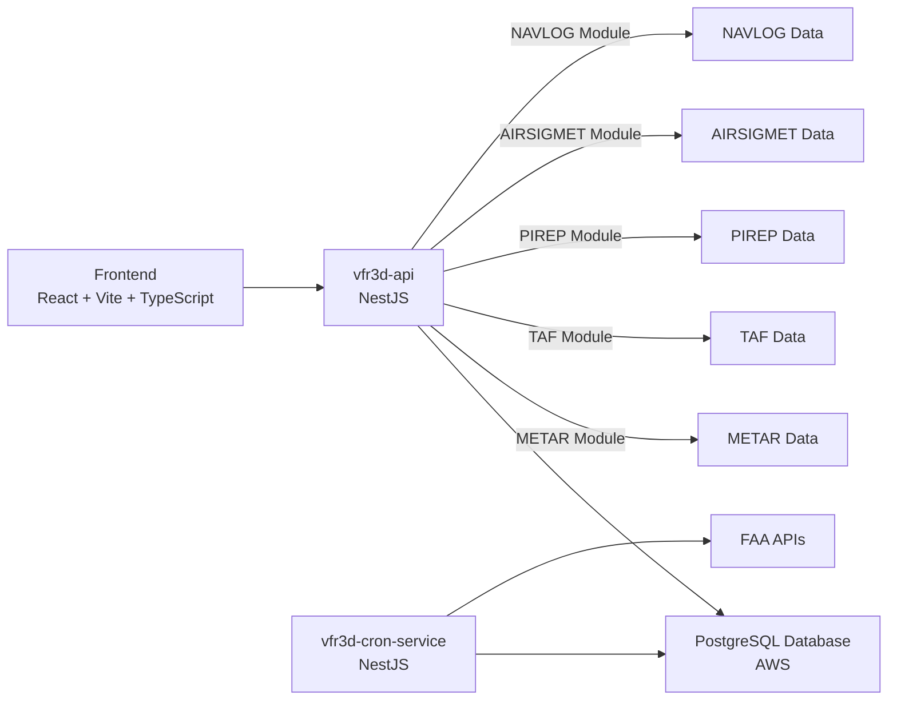

# VFR3D - 3D Geospatial Mapping Application for General Aviation Flight Planning

Welcome to the VFR3D GitHub repository! VFR3D is a cutting-edge 3D geospatial mapping application designed specifically for general aviation flight planning. With VFR3D, pilots can easily visualize and plan their flights in a intuitive and interactive 3D environment.

## Website

Visit our website at [www.vfr3d.com](https://www.vfr3d.com) to explore the features and capabilities of VFR3D.

## Architecture

The VFR3D application follows a modern and scalable architecture, leveraging the power of React, Vite, TypeScript, NestJS, and PostgreSQL. The architecture diagram below provides an overview of the system components and their interactions.

## Frontend
The VFR3D frontend is built using the following technologies:

React: A popular JavaScript library for building user interfaces.
Vite: A fast build tool that provides an optimized development experience.
TypeScript: A typed superset of JavaScript that enhances code reliability and maintainability.

## Backend
The VFR3D backend consists of two main services:

vfr3d-cron-service: This NestJS service is responsible for fetching weather data from FAA APIs and storing it in the PostgreSQL database. It runs periodically to ensure the data is up to date.
vfr3d-api: This NestJS service serves as the client-facing API for the VFR3D frontend. It provides endpoints for retrieving data from the PostgreSQL database and handling other application-specific functionalities. The vfr3d-api service includes the following modules:

METAR Module: Handles retrieval and processing of METAR (Meteorological Aerodrome Report) data.
TAF Module: Manages TAF (Terminal Aerodrome Forecast) data retrieval and processing.
PIREP Module: Deals with PIREP (Pilot Report) data retrieval and processing.
AIRSIGMET Module: Handles AIRSIGMET (Significant Meteorological Information) data retrieval and processing.
NAVLOG Module: Manages navigation log data and related functionalities.

Database
VFR3D utilizes a PostgreSQL database hosted on AWS to store and retrieve data efficiently. The database serves as the central repository for weather data fetched from FAA APIs and other application-specific data.

## Getting Started
To get started with VFR3D development, follow these steps:

Clone the repository: git clone https://github.com/your-username/vfr3d.git
Install dependencies for the frontend and backend services.
Configure the necessary environment variables for the backend services.
Run the development server for the frontend and backend services.

Detailed instructions and configuration guidelines can be found in the respective service directories.
Contributing
We welcome contributions from the community! If you'd like to contribute to VFR3D, please follow our contribution guidelines and submit a pull request.
License
VFR3D is released under the MIT License.
Contact
For any inquiries or feedback, please reach out to us at brandonberisford@gmail.com.
Happy flight planning with VFR3D!
